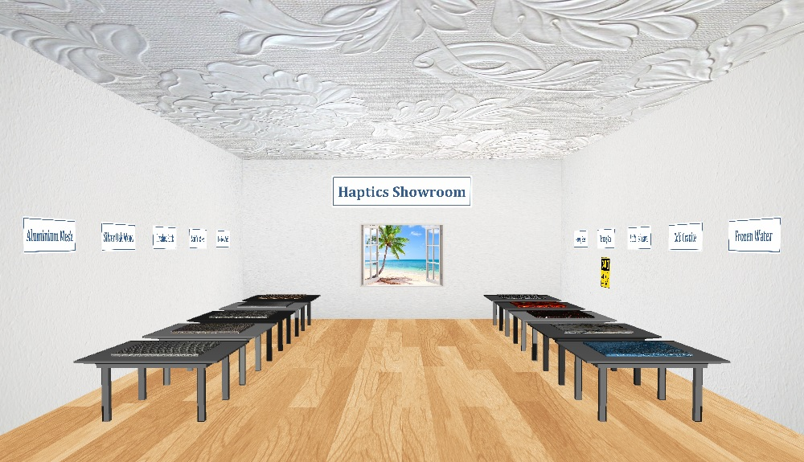

# haptics-showroom
This is repository contains the source code and documentation of the final project of the Computational Haptics lab conducted at the TUM summer semester 2017.

## General Idea

The general idea is to create a virtual room (like a show room), where you can walk around by pressing some keys (like in an ego shooter). Optionally also the Oculus Rift could be used to make the experience even more realistic. With one or two haptic devices as tools (or "hands") it is possible to interact with different objects placed inside the room. In this way people who are not familiar with Computational Haptics get to know many different possibilities what can be done in with haptic devices. 

## Important Notes

**This readme is not finished yet!**

## A view into the room

### Objects

* Fixed
  * Something cold: A glass bottle (or ice cube?) : smooth; Hardness; cold -> Peltier, Voice Coil
  * Something hot: Stone: coarse Roughness; Hardness; HOT -> Peltier,Voice Coil
  * Something sticky: have no idea what should the object be,maybe a cube first.
  * Something a bit rough: Metal can: Fine Roughness -> Voice coil
  * something a bit soft: Balloon: a littel bit soft; light; stickslip force; transparent -> Voice coil
* Moving
  * Ball

### To do

* The scenario is made up of a really big Sphere (details see OCULUS template one:cube) and a plate on bottom. 
* Naina will find a picture to show a Seebeach Scenario.
* Finishing the hardware tool (attaching the peltier element)
* Make two Classes: 
  - one is Class Cworld ::Object. It contains all the basic object properties.Each time we call back this class to get 5 Objects.
  - one is Class Cworld:: Database Object. It contains 5 objects' other properties, like sounds, texture, temperature....
* Highly recommended: Make one Global constant.h file.

### Ideas

* window or door you can open and close (perhaps with a lock)
* light switch or ligth dimmer which changes the light inside the show room
* a surface test wall with different properties like:
  - texture
  - friction
  - stiffness
  - magnetic
* brush to paint other objects
* pool filled with water to experince liquids
* interact with lying objects (throw, pile, pick up, etc.)
* haptic interface device modeled as line (by using two Falcons) -> display torque
* TV screen which shows room from another viewing angle
* anything with sound (e.g. squeaking door)

### Required Devices

* [Novint's Falcon](https://hapticshouse.com/pages/novints-falcon-haptic-device) haptic device
* [Phantom Omni](http://www.geomagic.com/de/products/phantom-omni/overview) haptic device (preferred, since compatible with the tool adapter)
* [Oculus Rift](https://www.oculus.com/rift/)
* Arduino Nano
* Peltier element
* Voice Coil (type: NCM02-05-005-4JB, [see here](https://www.h2wtech.com/product/voice-coil-actuators/NCM02-05-005-4JB))

## Structure of this Repository

* [doc](./doc) contains the documents related to this project.
* [material](./material) contains additional material concerning the project.

## Members

* **Naina Dhingra** - *[naina.dhingra@tum.de](mailto:naina.dhingra@tum.de)*
* **Ke Xu** - *[ke.xu@tum.de](mailto:ke.xu@tum.de)*
* **Hannes Bohnengel** - *[hannes.bohnengel@tum.de](mailto:hannes.bohnengel@tum.de)*
